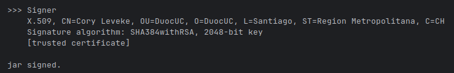
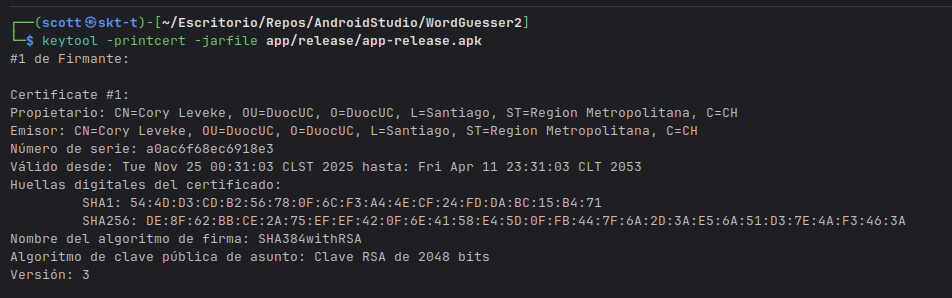

# 📱 WordGuesser - Aplicación Móvil Android

Este proyecto consiste en una aplicación móvil de adivinanzas desarrollada en **Kotlin** utilizando **Jetpack Compose**. La aplicación implementa una arquitectura **MVVM** (Model-View-ViewModel) y se conecta a un microservicio propio desarrollado en **Spring Boot** para la autenticación de usuarios y persistencia de datos.

## 👥 Integrantes
* **Cory Leveke**
* **Allan Nuñez**
* **Asignatura:** Desarrollo de Aplicaciones Móviles (DSY1105)
* **Sección:** 003D

## 🚀 Funcionalidades

### Módulo de Autenticación (Backend Integration)
* **Registro de Usuarios:** Permite crear una nueva cuenta. Los datos se envían al backend y se almacenan en una base de datos H2 en memoria.
* **Inicio de Sesión (Login):** Autenticación de usuarios mediante credenciales (usuario/email y contraseña). Valida la existencia del usuario en la base de datos.

### Módulo de Juego
* **Dinámica de Adivinanza:** El usuario debe adivinar una palabra secreta basándose en una pista de texto y una imagen referencial.
* **Sistema de Rondas:** Al acertar o fallar, se puede pasar a la siguiente palabra.
* **Retroalimentación Visual:** Mensajes de éxito o error al intentar adivinar.

### Características Técnicas
* **Persistencia de Datos:** Uso de base de datos H2 a través de una API REST propia.
* **Comunicación de Red:** Implementación de **Retrofit** para el consumo de servicios web.
* **Testing:** Pruebas unitarias implementadas con JUnit para validar la lógica de los ViewModels (`GameViewModel` y `LoginViewModel`).

## 🔗 Endpoints Utilizados

### 1. Microservicio Propio (Spring Boot)
La aplicación se conecta a un servidor local (configurado en `RetrofitClient` como `10.0.2.2` para el emulador o la IP local para dispositivos físicos).

| Método | Endpoint | Descripción |
| :--- | :--- | :--- |
| `POST` | `/api/auth/register` | Recibe un objeto JSON con `nombre`, `email` y `password` para crear un usuario. |
| `POST` | `/api/auth/login` | Recibe credenciales y valida el acceso del usuario. |

### 2. API Externa (Requisito Evaluación)
*[NOTA: Si implementaste una API externa para traer palabras random, descríbela aquí. Si usas solo datos locales, borra esta sección o indica que usas datos locales por ahora].*
* **URL:** `[URL_DE_TU_API_EXTERNA]`
* **Función:** Obtener palabras aleatorias para el juego.

## 🛠️ Pasos para Ejecutar el Proyecto

### Requisitos Previos
1.  Android Studio Koala o superior.
2.  JDK 17 o 21.
3.  IntelliJ IDEA (para el backend).

### Paso 1: Levantar el Backend
1.  Abrir el proyecto `wordguesser-backend` en IntelliJ IDEA.
2.  Ejecutar la clase principal `WordguesserApplication.java`.
3.  Verificar que la consola muestre `Started WordguesserApplication` en el puerto `8080`.

### Paso 2: Ejecutar la App Android
1.  Abrir el proyecto `wordguesser` en Android Studio.
2.  Sincronizar el proyecto con Gradle (Sync Project with Gradle Files).
3.  Seleccionar un dispositivo emulado (Virtual Device) o conectar un dispositivo físico.
    * *Nota: Si usa dispositivo físico, asegúrese de cambiar la IP en `RetrofitClient.kt`.*
4.  Presionar el botón **Run** (▶).

## 🧪 Pruebas Unitarias
El proyecto incluye pruebas para validar la lógica de negocio. Para ejecutarlas:
1.  Hacer clic derecho en la carpeta `com.example.wordguesser (test)`.
2.  Seleccionar "Run Tests in 'wordguesser'".
3.  **Cobertura:** Se validan los estados de éxito/error del Login y la lógica de aciertos del juego.

## 📦 Evidencia de Entrega (APK Firmado)

### Captura del APK generado y Keystore (.jks)
**
**

> El archivo `.jks` y el APK firmado se encuentran en la raíz del repositorio / carpeta de entrega.
